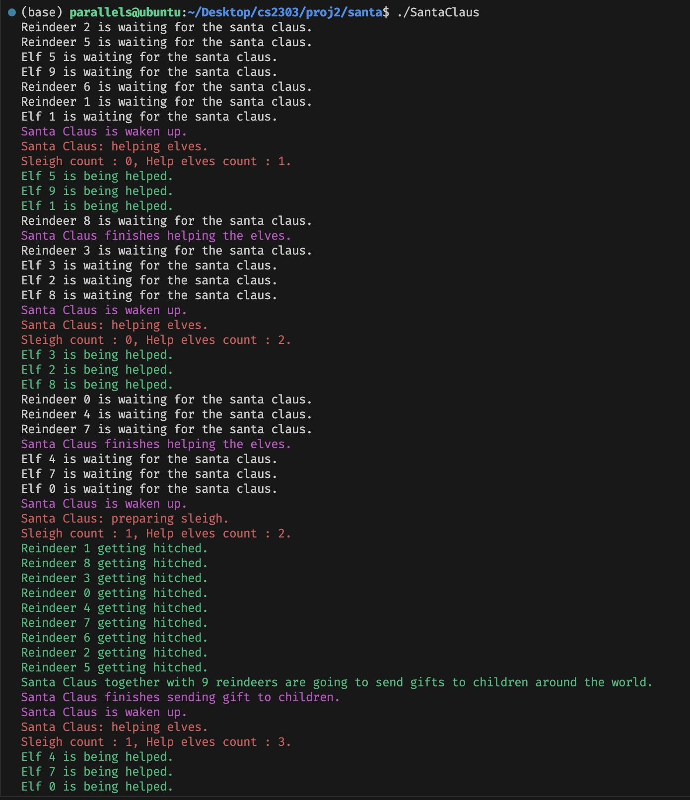
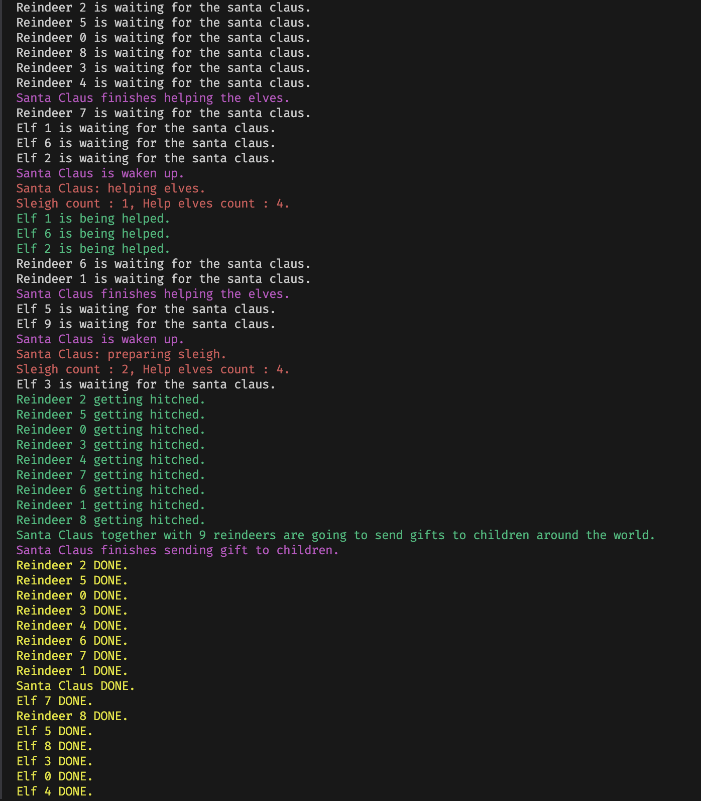
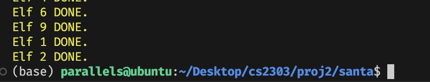

# Type script for project 2
## Compile
If you are at the current directory `proj2/`, you can compile via `make` to compile the project. You can call `make clean` to clean the project.
If you are at `proj2/burger` or `proj2/santa`, you can also call `make` to compile, which will use Makefile inside the subdirectory.

## Usage
- Burger Buddies Problem
```bash
./BBC <numCooks> <numCashiers> <numCustomers> <numRacks>
```
- Santa Claus Problem
```bash
./SantaClaus
```
The default round in Santa Claus Problem is 30. You can change it by modifying the `ROUNDS` macro in `SantaClaus.c` line 10.

## Execution Output
### Burger Buddies Problem
#### Successful Execution
I test the program with `./BBC 2 2 10 41` and the output is as follows.
```bash
Cooks [2], Cashiers [2], Customers [10], Rack[41]
Begin run.

Customer [1] comes.
Customer [1] is being served by cashier [1].
Customer [7] comes.
Customer [6] comes.
Customer [5] comes.
Customer [4] comes.
Customer [8] comes.
Customer [3] comes.
Customer [9] comes.
Customer [2] comes.
Customer [10] comes.
Cook [1] cooks a burger and puts it into the rack.
Cook [1] cooks a burger and puts it into the rack.
Cashier [1] accepts an order.
Customer [7] is being served by cashier [2].
Cashier [1] takes a burger from the rack to the customer.
Customer [1] receives the burger from cashier [1] and leaves.
Cook [2] cooks a burger and puts it into the rack.
Cashier [2] accepts an order.
Customer [6] is being served by cashier [1].
Cook [1] cooks a burger and puts it into the rack.
Cashier [1] accepts an order.
Cook [2] cooks a burger and puts it into the rack.
Cook [2] cooks a burger and puts it into the rack.
Cashier [1] takes a burger from the rack to the customer.
Customer [6] receives the burger from cashier [1] and leaves.
Cook [1] cooks a burger and puts it into the rack.
Customer [5] is being served by cashier [1].
Cashier [2] takes a burger from the rack to the customer.
Customer [7] receives the burger from cashier [2] and leaves.
Customer [4] is being served by cashier [2].
Cashier [1] accepts an order.
Cashier [2] accepts an order.
Cashier [1] takes a burger from the rack to the customer.
Customer [5] receives the burger from cashier [1] and leaves.
Customer [8] is being served by cashier [1].
Cook [2] cooks a burger and puts it into the rack.
Cook [1] cooks a burger and puts it into the rack.
Cashier [2] takes a burger from the rack to the customer.
Customer [4] receives the burger from cashier [2] and leaves.
Customer [3] is being served by cashier [2].
Cashier [1] accepts an order.
Cook [2] cooks a burger and puts it into the rack.
Cashier [2] accepts an order.
Cashier [2] takes a burger from the rack to the customer.
Customer [3] receives the burger from cashier [2] and leaves.
Customer [9] is being served by cashier [2].
Cook [1] cooks a burger and puts it into the rack.
Cook [2] cooks a burger and puts it into the rack.
Cashier [1] takes a burger from the rack to the customer.
Customer [8] receives the burger from cashier [1] and leaves.
Cashier [2] accepts an order.
Customer [2] is being served by cashier [1].
Cashier [2] takes a burger from the rack to the customer.
Customer [9] receives the burger from cashier [2] and leaves.
Cook [2] cooks a burger and puts it into the rack.
Cook [1] cooks a burger and puts it into the rack.
Cook [2] cooks a burger and puts it into the rack.
Cook [1] cooks a burger and puts it into the rack.
Cashier [1] accepts an order.
Customer [10] is being served by cashier [2].
Cook [2] cooks a burger and puts it into the rack.
Cashier [1] takes a burger from the rack to the customer.
Customer [2] receives the burger from cashier [1] and leaves.
Cook [2] cooks a burger and puts it into the rack.
Cashier [2] accepts an order.
Cook [1] cooks a burger and puts it into the rack.
Cook [2] cooks a burger and puts it into the rack.
Cashier [2] takes a burger from the rack to the customer.
Customer [10] receives the burger from cashier [2] and leaves.

All customers have left, DONE.
```

#### Error Handling
- Wrong number of command line arguments. Too few arguments or too big/small arguments.

```bash
./BBC 2 0 1

Usage: ./BBC <numCooks> <numCashiers> <numCustomers> <numRacks>

./BBC 2 0 1 2

Invalid input.

./BBC 200 10 21 30

Too many cooks/cashiers/customers/racks. Risks of threads number overflow.
```
- Failed initialization of mutexes and semaphores.

```bash
Failed to init <mutex/semaphore name>. 
```

- Fail to create a thread.

```bash
Failed to create <type {cook, cashier, customer}> thread #<id>
```

- Fail to join a thread.

```bash
Failed to join customer thread #<id>
```

- Fail to cancel a thread.

```bash
Failed to cancel <type {cashier, cook}> thread #<id>
```

- Fail to destroy a mutex or semaphore.

```bash
Failed to destroy <mutex/semaphore name>
```

### Santa Claus Problem
#### Successful Execution
I test the program with `./SantaClaus` and the output is as follows. I use round 2. So it is not that long.





You can check the different color. Waiting information is white. Santa claus being waken up and finish helping is purple. The current elf being helped or the current reindeer being hitched is green. The count of santa claus being waken up by elf or reindeer is red. And the exit info is printed in yellow. I hope this can help you understand the program better.

#### Error Handling
- Failed initialization of mutexes and semaphores.

```bash
Failed to initialize <mutex/semaphore name>. 
```

- Fail to create a thread.

```bash
Failed to create <type {santa claus, elf, reindeer}> thread #<id>
```

- Fail to join a thread.

```bash
Failed to join <type {santa, elf, reindeer}> thread #<id>
```

- Fail to destroy a mutex or semaphore.

```bash
Failed to destroy <mutex/semaphore name>
```
