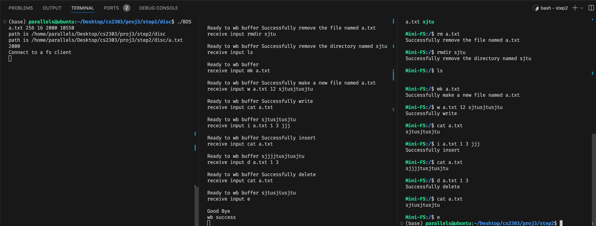

# Type script of Project 3
## Compile
You can compile the whole project via `make` at `proj3/` path, or you can compile each step separately by `make` at `proj3/stepX/` path. 

We reuse the code of the disc server in step2 and step3, so after you compile the file server in step2/3, you should step into the disc subdirectory and compile the disc server by `make` .

You can follow the steps below to compile the project:
```bash
# Way 1
cd proj3/
make

# Way 2
cd proj3/step1
make

cd proj3/step2
make
cd proj3/step2/disc
make

cd proj3/step3
make
cd proj3/step3/disc
make
```

## Step 1
Run the disc server via the following command.
```bash
./BDS <DiscFileName> <#cylinders> <#sector per cylinder> <track to track delay> <port>
```

Run the command line disc client via the following command.
```bash
./BDC_CLI <DiscServerAddress> <port>
```

Run the randomly generated disc client via the following command.
```bash
./BDC_RAND <DiscServerAddress> <port>
```

### Run commands
- `I`
    - Information query. Returns the number of cylinders, the number of sectors per cylinder
- `R <cylinder> <sector>`
    - Read request for the contents of given cylinder and sector
- `W <cylinder> <sector> <length> <data>`
    - Write request for the given data to the given cylinder and sector
- `R <index>`
    - Additionally supported read request. Read the data from the given index
- `W <index> <length> <data>` 
    - Additionally supported write request. Write the data to the given index
- `Q`
    - Exit from client side

### Error handling
- Fail to `open` a file.
```bash
Error in creating or opening file.
```
- Fail to `lseek` the file.
```bash
Error calling lseek() to stretch the file.
```
- Fail to `write` to a file.
```bash
Error writing last byte of the file.
```
- Fail to `mmap` the file to the memory.
```bash
Error: Could not map file.
```
- Fail to `munmap` the file and memory.
```bash
Error when unmmaping the memory space allocated to the file.
```
- Fail to `close` the file.
```bash
Error when closing the file descriptor.
```
- Input command length is 1, but does not start with `I`
```bash
Wrong types of command of length 1. Please input 'I'
```
- Input command length is 2, but does not start with `R`
```bash
Wrong types of command of length 2. Please input 'R [index]'.
```
- Input command length is 3, but does not start with `R`
```bash
Wrong types of command of length 3. Please input 'R [cyclinder] [sector]'.
```
- Input command length is 4, but does not start with `W`
```bash
Wrong types of command of length 4. Please input 'W [index] [len] [data]'.
```
- Input command length is 5, but does not start with `W`
```bash
Wrong types of command of length 5. Please input 'W [cyclinder] [sector] [length] [data]'.
```
- Fail to `atoi` the sector and cylinder number.
```bash
Invalid cyclinder number, check it out.
```
### Example 
Check the following fig.


## Step 2
> Do not use the disc server in step 1. Use the one in step2/disc.

Run the disc server in `proj3/step2/disc/` via the following command.
```bash
./BDS <DiscFileName> <#cylinders> <#sector per cylinder> <track to track delay> <port>
```

Run the file server via the following command.
```bash
./FS <DiscServerAddress> <BDSPort> <FSPort>
```

Run the file client via the following command.
```bash
./FC <FileServerAddress> <FSport>
```

### Run commands
- `f`
    - Format the disc
- `mk <filename>`
    - Create a file in the current directory
- `mkdir <Dirname>`
    - Create a directory in the current directory
- `rm <filename>`
    - Remove a file in the current directory
- `rmdir <Dirname>`
    - Remove a directory in the current directory
- `cd <Dirname>`
    - Change the current directory
    - <Dirname> should be ***RELATIVE PATH***
- `ls`
    - List the files and subdirectories in the current directory
- `cat <filename>`
    - Display the content of the file
- `w <filename> <length> <data>`
    - Write the length of data to the file
    - Overwrite the previous file contents.
- `i <filename> <pos> <length> <data>` 
    - Insert the length of data to the file at the given position
- `d <filename> <pos> <length>`
    - Delete the length of data from the file at the given position
- `e`
    - Exit from the ***file client*** side
- Use Ctrl + C in file server side to exit.

### Error handling
Disc server error handling is the same with the previous part, we will just present that of file system part.

- Fail to create a socket via `socket`
```bash
Socket creation failed
```
- Fail to bind to a socket to an address
```bash
Invalid address/ Address not supported
```
- Fail to connect to the server via `connect`
```bash
Connection Failed
```
- Fail to `recv` message from server
``` bash
Receive failed
```
- Call operation functions but does not initialize the file system
```bash
File system not initialized.
```
- If the name of the file/dir to create is invalid
```bash
Invalid name.
```
- If we want to write to a file that does not exist.
```bash
File not found.
```
- If we want to insert into a invalid position of the file. E.g. the pos is negative or greater than the size of the file.
```bash
Invalid position.
```
- If we input invalid unsupported command.
```bash
Invalid command.
```
- If the disc size is smaller than RESERVE BLOCKS.
```bash
Block size is too small.
```
- There are a lot of functions in `inode.c` that will return -1 if error happens. We will not list them all here. Just take `dir_add_entry` as an example. If the current inode is not a directory, it will return -1.
```C
if (inode->_mode != 1) {
        return -1;
}
```

### Example
Check the following fig.



## Step 3
> Do not use the disc server in step 1 and step 2. Use the one in step3/disc.

Run the disc server in `proj3/step3/disc/` via the following command.
```bash
./BDS <DiscFileName> <#cylinders> <#sector per cylinder> <track to track delay> <port>
```

Run the file server via the following command.
```bash
./FS <DiscServerAddress> <BDSPort> <FSPort>
```

Run the file client via the following command.
```bash
./FC <FileServerAddress> <FSport>
```

> Note that in step 3, we just add some commands and modify part of the design in step 2, so the run commands and error handling are quite similar to that of step 2. I will only show the unique part in step 3.

### Run commands
- `cr <username> <password>`
    - Create a user with the given username and password
- `login <username> <password>`
    - Login with the given username and password
- `chmod <filename> <new permission>`
    - Change the permission of the file
- `e`
    - Exit at the ***file client*** side
- Use Ctrl + C in file server side to exit.

### Error Handling
- Create a new user, but **not** at ROOT user mode.
```bash
Permission denied. cr needs super permission.
```
- Create a new user, but **not** at the ROOT path `/`.
```bash
You can only create user when you are in / path.
```
- User count exceeds the upper bound.
```bash
Exceed maximum clients. At most 5!
```
- Log into a user, but **not** at the ROOT path `/`.
```bash
You can only login when you are in / path.
```
- `chmod` the permission of a file/dir, but the current user is **not** the owner or ROOT.
```bash
Permission denied. chmod needs super permission or you need to be the owner.
```
- Perform operations like `ls, mk`, but the current user does not have enough permission.
```bash
Permission denied. <operation> needs <read/write/exec> permission.
```

### Example
Check the following fig.

